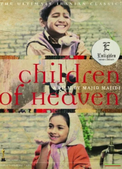
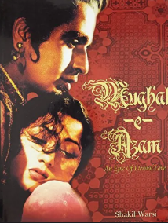
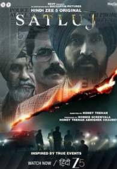

# My Favorite Movies

I don't watch movies. 

Recently out of nowhere one day I decided to watch Mughal-e-Azam(still to this day I don't know the reason). After watching the film, it made me realize by not watching movies I'm missing out one of the most effective medium to tell a story. 

Therefore I decide to watch movies, but not just any movies. 

Movies with compelling story that resonated with the human soul.

 

Here is a list of movies that I've watched.

## Movies Watched

<table>
  <tr>
    <td align="center" width="25%">
      
    </td>
    <td align="center" width="25%">
      
    </td>
    <td align="center" width="25%">
      
    </td>
    <td align="center" width="25%">
      
    </td>
  </tr>
   <tr>
    <td align="center" width="25%">
      
    </td>
    <td align="center" width="25%">
      
    </td>
  </tr>
</table>